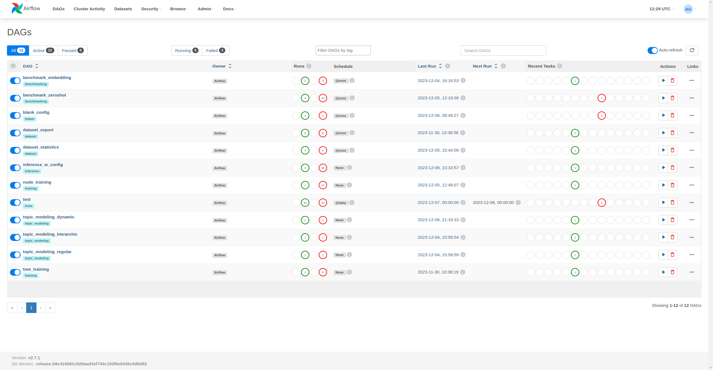

.. sparql-mono documentation master file, created by
   sphinx-quickstart on Mon Nov 13 08:35:42 2023.
   You can adapt this file completely to your liking, but it should at least
   contain the root `toctree` directive.

#######################################
Welcome to sparql-mono's documentation!
#######################################

************
Introduction
************
In the era of Big Data, extracting meaningful insights from vast repositories of information is crucial for informed
decision-making.
This project addresses the challenge of analyzing and utilizing annotation data stored in a SPARQL database.
It encompasses a comprehensive framework that integrates with SPARQL, extracts statistical information from the annotations,
performs benchmarking for various machine learning approaches, trains supervised models based on a taxonomy tree,
and executes inference using predefined configurations.

Key features:
#############
* **SPARQL Integration**: Seamlessly connects with SPARQL endpoints to retrieve and manipulate annotation data.

* **Annotation Statistics Extraction**: Provides detailed statistical insights into the annotation data, such as
   frequency distributions, co-occurrence patterns, and semantic relationships.

* **Benchmarking Suite**: Evaluates the performance of supervised, embedding, and zero-shot approaches for annotation
   tasks, enabling informed model selection.

* **Taxonomy-Driven Model Training**: Trains supervised models guided by a taxonomy tree, leveraging the hierarchical
   structure to capture fine-grained semantic relationships.

* **Configurable Inference**: Executes inference based on predefined configurations, allowing for the integration of
   various machine learning models and unsupervised approaches.

* **Model Prediction Population**: Populates new model predictions directly into the SPARQL database, enriching the
   annotation knowledge base.

To enable all this, we used:
############################

* **Airflow**, an opensource workflow management platform for data engineering pipelines. A more in depth review of how
we utilize this can be found here

* **MlFlow**, another opensource platform for managing the end-to-end machine learning lifecycle. A more in depth review
of how we utilize this can be found here

* **Annotation** tool, our own opensource UI created with react Admin. More information can be found under the UI
section of the docs here

**************
Infrastructure
**************
The current infrastructure consists out of the following  services that are chained together:

#. Airflow :ref: `Airflow<Airflow>`

#. Mlflow :ref: `Mlflow<Mlflow>`

#. BEAT :ref: `BEAT<BEAT>`

.. _Airflow:
Airflow
#######
Apache Airflow is an open-source workflow management platform designed to automate and manage workflows as directed
acyclic graphs (DAGs). It is a popular tool for building and managing data pipelines, ETL/ELT processes, and other
batch-oriented workflows.

Airflow user manual: |airflow_user_manual|

.. |airflow_user_manual| replace::
   :download:`airflow_user_manual <_source/Airflow.pptx>`

General information about airflow
#################################

Key Features of Airflow
*********************

* **DAG-based workflow definition**: Airflow workflows are defined using DAGs, which provide a clear and concise way to
   represent the tasks in a workflow and their dependencies.

* **Scheduling and execution**: Airflow can schedule tasks to run at specific times or intervals, and it can also handle
   dependencies between tasks, ensuring that tasks are executed in the correct order.

* **Monitoring and alerts**: Airflow provides a web interface for monitoring the status of DAGs and tasks, and it can
   also send alerts when tasks fail or run unexpectedly.

* **Scalability**: Airflow is designed to be scalable, and it can be deployed on a single server or on a distributed cluster.

Benefits of Using Airflow
*************************

* **Increased productivity**: Airflow can automate many of the manual tasks involved in managing workflows, which can
   free up developers to focus on more creative work.

* **Improved reliability**: Airflow can help to ensure that workflows are executed reliably and consistently, which can
   reduce the risk of errors and data loss.

* **Reduced costs**: Airflow can help to reduce the cost of managing workflows by automating tasks and improving efficiency.

Use Cases for Airflow
*********************
Airflow is a versatile tool that can be used for a wide variety of workflows. Some common use cases include:

* **ETL/ELT data pipelines**: Airflow can be used to automate the process of extracting, transforming, and loading data
   from one system to another.

* **Batch processing**: Airflow can be used to automate batch processing tasks, such as data analysis, report generation,
   and file processing.

* **Machine learning pipelines**: Airflow can be used to automate the training and deployment of machine learning models.

* **Business process automation**: Airflow can be used to automate business processes, such as order processing and
   customer onboarding.

Entrypoints and DAGs in Airflow
*******************************
In Apache Airflow, entrypoints and DAGs (Directed Acyclic Graphs) are two closely related concepts that play a crucial
role in managing and executing workflows.

Entrypoints
===========
A Python entrypoint is a mechanism for defining a function or other callable object that can be invoked from the command
line when a package is installed.
This allows developers to create scripts that can be easily run by other users without requiring them to have any
knowledge of the internal workings of the package.

Typically, an airflow component calls an entrypoint (or script) in order to execute the functionality that is provided
via the recipe (DAG)

DAGs
====
A DAGs represent the workflows themselves, it defines a certain 'recipe'/workflow that should be executed when the dag
is started.
They are defined using Python code and specify the tasks to be executed, their dependencies, and the schedule for
running them.
Airflow parses DAG files and creates a DAG object for each DAG definition.

Relationship between Entrypoints and DAGs
=========================================
In essence, in this project entrypoints are a near one-on-one mapping for the provided functionality.
They serve as the gateway between the UI representing the DAGS and the backend that contains all processing logic in
order to execute the specified task succesfully

Getting Started with Airflow
****************************
To get started with Airflow, you can follow the official installation guide:
https://airflow.apache.org/docs/apache-airflow/stable/tutorial/index.html

Additional Resources
********************
Airflow Documentation: https://airflow.apache.org/docs/

Airflow Github: https://github.com/apache/airflow

Airflow Community Forum: https://forum.astronomer.io/

.. _Mlflow:
MLFLOW: An open-source platform for managing the machine learning lifecycle
###########################################################################
In the rapidly evolving field of machine learning, managing the entire machine learning lifecycle, from experimentation
to deployment, is a complex and challenging task. This is where MLflow, an open-source platform, comes into play.
MLflow streamlines the entire machine learning lifecycle by providing a comprehensive set of tools for tracking
experiments, packaging models, deploying them, and managing them throughout their lifecycle.

Mlflow user manual: |mlflow_user_manual|

.. |mlflow_user_manual| replace::
   :download:`mlflow_user_manual <_source/Mlflow.pptx>`

Why Use MLflow?
***************

MLflow offers a compelling set of reasons to adopt it as your go-to machine learning platform:

* **Centralized Experiment Tracking**: MLflow keeps track of all your machine learning experiments, including parameters,
metrics, and results, providing a centralized repository for experiment data.

* **Model Packaging and Versioning**: MLflow provides a standardized format for packaging machine learning models,
ensuring reproducibility and simplifying model sharing.

* **Model Deployment and Serving**: MLflow streamlines model deployment to production environments, enabling you to
serve your models to applications and systems.

* **Model Lifecycle Management**: MLflow manages the entire machine learning lifecycle, from experimentation to
deployment, ensuring consistent and reliable model management practices.

Key Advantages of MLflow
************************

* **Reproducibility**: MLflow's experiment tracking and model packaging capabilities ensure that experiments and models
can be reproduced with ease.

* **Collaboration**: MLflow facilitates collaboration among data scientists by providing a shared platform for experiment
tracking, model sharing, and model deployment.

* **Governance**: MLflow enables governance by providing a centralized repository for experiment data and models,
promoting transparency and accountability.

* **Portability**: MLflow's standardized model format ensures that models can be seamlessly deployed across different
platforms and environments.

* **Scalability**: MLflow's modular architecture and support for distributed environments make it scalable for large-scale
machine learning projects.

In conclusion, MLflow stands as a powerful tool for managing the machine learning lifecycle, offering reproducibility,
collaboration, governance, portability, and scalability. By adopting MLflow, data scientists and organizations can
streamline their machine learning workflows, enhance collaboration, and accelerate the deployment of effective machine
learning solutions.

Additional Resources
*********************
Mlflow Documentation: https://mlflow.org/docs/latest/index.html

Mlflow Github: https://github.com/mlflow/mlflow

Mlflow forum: https://github.com/mlflow/mlflow/issues

.. _BEAT:
BeAT (Annotation UI)
####################
This platform handles the annotation of decisions made by the parlement of Ghent. It serves as a critical nexus between
human expertise and advanced machine learning models. Our platform uniquely combines human and model annotations,
exclusively focused on generating a high-quality dataset for initial model training. Subsequently, the platform
facilitates ongoing evaluation and correction of the annotations made by machine learning models, ensuring continuous
refinement of the performance.
At BeAT, our exclusive use case centers around the creation of a robust dataset instrumental in training, evaluating,
and correcting machine learning models. This singular focus underscores our commitment to harnessing the synergy between
human insights and AI capabilities to optimize the precision and efficacy of decision analysis.

BeAT user manual: |beat_user_manual|

.. |beat_user_manual| replace::
   :download:`beat_user_manual <_source/BEAT.pptx>`

*************
Current setup
*************

In this section, you will find a more in depth overview on how each entrypoint is integrated with each-other.
These integrations will be visualized using screenshots, code-snippits and general information on what they can/should
be used for.

Benchmarking
############

The benchmarking DAGs are used to benchmark certain types of model configurations (dataset, model_flavour and base model).
During development, we defined three model types that are interesting for this classification use-case:

#. **Supervised classification** is the most common type of classification task. In supervised classification, the model
   is trained on a labeled dataset, where each data point is associated with a known class label. The model learns to map
   the input data points to their corresponding class labels.

#. **Zero-shot classification** is a more challenging task, as the model is not given any labeled training data for the
   new classes it needs to classify. Instead, the model is trained on a large dataset of text or images, and it learns to
   represent these data points in a way that captures their semantic meaning. The model then uses this semantic
   understanding to classify new data points into unseen classes.

#. **Embedding similarity** is a technique for measuring the similarity between two data points. In the context of
   classification, embedding similarity can be used to classify new data points by comparing them to known examples of each
   class. The data point is assigned to the class whose known example it is most similar to.

.. csv-table:: Comparison of classification approaches
   :file: _source/model_overview.csv
   :header-rows: 1

Our implementation:

Our benchmarking is implemented with a focus on abstracting, reproducability and modularity.
We implemented all components required for benchmarking in an abstract manner, this allows us to easily change what is
happening under the hood, while keeping the same functionality.

The model wrapper is the type of implementation used with the huggingface base model.
The datasets are used to format the data from sparql into a more processable format for the AI implementation
The benchmark framework is what type of benchmarking (single- vs multi-label)
Evaluation framework is a framework for the metric calculations

All these components together create artifacts that are logged to mlflow

Benchmarking Embeddings
***********************

Embedding based benchmarking is based on the unsupervised models.
These models are used to transform text into a semantic vector representation, these representations will be created for
the input text and the labels that we are trying to match
Once these vectors are created, we can use cosine similarity as a distance metric in order to define the distance between
labels and text.

Input
=====

 :model_types:
     The model type parameter is used to specify what model type(s) you are using for your benchmarking.
     This can be provided in two separate ways:

         1.  An actual list with values that can be found in the ModelType enum (most likely passed as string values).
             Keep in mind that the values in this list need te be matching with the enum values exactly!
             This list should be provided with comma's to separate the values (see run command example).

         2.  You can provide a string prefix, this prefix will be used to identify all relevant models.
             These models will automatically be added to the list of model types to experiment with.

 :dataset_types:
     The dataset type parameter is used to specify what type of dataset(s) you want to use for the benchmarking run.
     The dataset type can be provided in two separate ways:

         1.  An actual list with values that can be found in the DatasetType enum (will be passed as string values),
             this list should be provided with comma's for separation (see run command example).

         2.  String prefix value that will be matched to the current enum values. all matching enum values will be used
             for the benchmarking run.

 :model_ids:
     This parameter requires a list of models to run the benchmarking with, this will be huggingface model references.
     Keep in mind that models from zeroshot might work for embeddings. however the other way around they won't.
     It is advised not to mix zeroshot, benchmarking and classifier models when running experiments, it would be better
     (and more functional) to split these up in multiple benchmarking runs.

 :taxonomy_uri:
     The string reference to what taxonomy you want to use for the benchmarking process.

Output
======

You a run that contain multiple nested runs, depending on the configuration it is possible that the nested runs contain
more nested runs.
In the image below you get a visual representation of this:

When you click on one of the leaf nodes, you end up on the following screen:

This run contains some information about what base model is used:

More information about the dataset can not only be found in the unique naming of the run, but also in the parent runs that
contain the permutation information

When looking at the metrics, you notice that most of them will usually end up with 0 during the benchmarking:

In order to get correct results, you would like to visualize these using mlflow, when done properly (see user guide)
you end up with one of these plots:

In the artifact section, you can find more information about the performance of the model at each threshold:

You have to confusion matrix's:

And the classification_reports:

You also get a similar visualization as the mlflow metrics we previously showcased:

And as finishing touch, you get a precision-recall plot

The precision recall plots are used for:

#. Compare the performance of different classifiers: By comparing the PR curves of different classifiers, you can see
   which one achieves a better balance between precision and recall.

#. Select the optimal threshold: The PR curve allows you to select the threshold that best suits your specific needs.
   For instance, if you prioritize avoiding false positives, you would choose a threshold that results in a higher precision.
   Conversely, if you prioritize identifying all true positives, you would choose a threshold that leads to a higher recall.

#. Identify class imbalance: If the PR curve is skewed towards one side, it indicates that the dataset is imbalanced.
   This can affect the overall performance of the classifier and may require specialized techniques to address.

#. Interpret the trade-off between precision and recall: The PR curve visualizes the trade-off between precision and
   recall, allowing you to understand how changes in the threshold affect these two metrics.

#. Highlight the sensitivity of the classifier: A sharp increase or decrease in the PR curve near certain thresholds
   indicates that the classifier is more sensitive to changes in the threshold in those regions.

Overall, PR plots are valuable tools for evaluating binary classifiers and understanding their performance in terms of
both precision and recall. They provide a comprehensive view of the classifier's behavior across different thresholds
and can help you make informed decisions about model selection and threshold optimization.

Benchmark zeroshot
******************

Benchmarking with zero shot models is done in a similar manner to the embedding benchmarking.
The main difference is that we do not use a distance metric with the vector representation output, but the model itself
does the matching using natural language interpreteren (nli)/ natural language understanding (nlu) concepts
As output you get a range of confidences that represent the match between the label and the text itself.

Input
=====

 :model_types:
     The model type parameter is used to specify what model type(s) you are using for your benchmarking.
     This can be provided in two separate ways:

         1.  An actual list with values that can be found in the ModelType enum (most likely passed as string values).
             Keep in mind that the values in this list need te be matching with the enum values exactly!
             This list should be provided with comma's to separate the values (see run command example).

         2.  You can provide a string prefix, this prefix will be used to identify all relevant models.
             These models will automatically be added to the list of model types to experiment with.

 :dataset_types:
     The dataset type parameter is used to specify what type of dataset(s) you want to use for the benchmarking run.
     The dataset type can be provided in two separate ways:

         1.  An actual list with values that can be found in the DatasetType enum (will be passed as string values),
             this list should be provided with comma's for separation (see run command example).

         2.  String prefix value that will be matched to the current enum values. all matching enum values will be used
             for the benchmarking run.

 :model_ids:
     This parameter requires a list of models to run the benchmarking with, this will be huggingface model references.
     Keep in mind that models from zeroshot might work for embeddings. however the other way around they won't.
     It is advised not to mix zeroshot, benchmarking and classifier models when running experiments, it would be better
     (and more functional) to split these up in multiple benchmarking runs.

 :taxonomy_uri:
     The string reference to what taxonomy you want to use for the benchmarking process.

Output
======

The output of this is similar to the output of the embedding models.

Helper
######

The helper functions enable some basic utilities that can be helpfull for this project

Blank config
************

This entrypoint is used to generate the empty configuration for the config based inference job.

Input
=====

This entrypoint does not require any extra input, since the configurations are generated for each taxonomy that is
linked to the parent taxonomy node.
These taxonomy nodes are automatically parsed into the structured format and will result in the configurations.
An example of these configurated configurations can be found in the inference with config information section of the docs.

Output
======

The output of the blank config, is an empty config in json and yaml format for each taxonomy that has been found:

The output in mlflow looks like this:

While one of the jsons is formatted in this manner:

Dataset
#######

Here you can find most of the relevant information about entrypoints that unlock capabilities for the datasets

Dataset export
**************

This entrypoint is simply to create an export of a given dataset with a given configuration.
This could be usefully down the line if there is a need for a annotated dataset that can be used for downstream
experimentation and other tasks.

Input
=====

    :dataset_type: The type of dataset you want to extract
    :taxonomy_uri: The taxonomy you want to create the dataset for.

Output
======

As you would expect, the artifacts from a dataset export run is a dataset. This dataset is saved in json format.

Dataset statistics
******************

This entrypoint is used to generate dataset statistics, these statistics can be found in two manners:

#. Level based overview of the label distribution (Since it is a multilabel - multilayer taxonomy classification setup,
   it is possible there will be more registered labels per class than decisions)

#. Taxonomy node label distribution, a visual representation of each specific taxonomy node that can be found in the taxonomy.

Input
=====

In the image below, you can clearly see that this entrypoint only has one configurable parameter.

params:

.. image:: _static/images/airflow/dataset_statistics_config.png

Output
======

The output is a collection of artifacts, these artifacts are grouped per taxonomy.
In the image below, you can see the rough structure of these outputs, in the sub folders you can find the
visualizations of the label distribution

Inference
#########

Once the AI model is trained, it can be used to make predictions or decisions about new data. This is done by passing
new data through the trained model. The model then processes the data, applies its learned patterns and relationships,
and generates an output prediction or decision.

In other words, inference is the moment of truth for an AI model. It is the time when the model puts its knowledge to
the test and demonstrates its ability to generalize from what it has learned to new situations. Inference is a critical
part of any AI application, as it allows AI models to be used in real-world scenarios where new data is constantly being
generated.

Inference with config
*********************

Config based inference is the suggested inference method that we propose, it enables for a high level of customization.
Working with the configs generated by the Blank_config helper, you can specifically select models for each node of the
taxonomy.
You adapt this config to your own needs. For example you can only supply one of the nodes in the taxonomy at lvl3 and it
will only predict for that specific node.

Some considerations that should be made when working with this config are:

#. When selecting models, you should make sure that you specify what model flavour it is. For the huggingface flavour,
   you should make sure that mlflow:/ is used as prefix when it comes form our local mlflow model registry, otherwise you
   can simply use the model_id.For Embedding and Zeroshot models, you should check the docs for the currently benchmarked
   models with their own define thresholds, these thresholds should result in the best performance for each of these models.

#. The more leaf nodes you supply, the more leaf nodes it will process

When working with the config based inference and you want to use an unsupervised model.
We suggest you stick with embedding models, these are more lightweight and perform slightly better:

**Embedding model**:

* multi-qa-mpnet-base-dot-v1 -> 0.35-0.45

* gte-large -> 0.80-0.85

* multilingual-e5-small -> 0.80-0.85

* paraphrase-multilingual-mpnet-base-v2 -> 0.28-0.39

**Zeroshot models**: (These have to be double checked, might be incorrect behaviour here)

* xlm-roberta-large-xnli ->0-0.31

* multilingual-e5-base-xnli-anli -> 0-0.13

* m1_article_bart-large-mnli -> 0-0.25

* mDeBERTa-v3-base-xnli-multilingual-nli-2mil7 -> 0- 0.02

When you want to work with the registered models in mlflow, you will have to prefix them with 'mlfow:/' (You can also
find this in the config below)

An example config:

.. literalinclude:: _source/business_capabilities_example.json
   :language: json
   :linenos:

Input
=====

    :taxonomy_uri: the taxonomy to use for the prediction
    :model_config: the json config to use to create the prediction trees with
    :dataset_type: the type of dataset to use for the model training

Output
======

The output of the tree based inference can be viewed in BEAT. You will find another entry in the annotations list:

Training
########

Supervised multilabel classification is a type of supervised learning task that involves classifying data into multiple
categories simultaneously. This is in contrast to traditional binary classification, where data is classified into only
two categories.

For example, a supervised multilabel classification model could be used to classify emails as spam, phishing, or
legitimate; or to classify images as containing a cat, a dog, or a person.

Supervised multilabel classification has several advantages over traditional binary classification:

#. It can capture more information about the data. By classifying data into multiple categories, supervised multilabel
   classification can capture more of the nuances and complexities of the data. This can be particularly useful when the
   data is naturally multi-faceted, such as when classifying images or text documents.

#. It can be more efficient. In some cases, supervised multilabel classification can be more efficient than training
   multiple separate binary classifiers. This is because the model can share information between the different categories, which can improve the accuracy of all of the predictions.

#. It can be more flexible. Supervised multilabel classification can be used to classify data into any number of
   categories, and the categories can be overlapping or hierarchical. This makes it a versatile tool that can be adapted to
   a wide variety of tasks.

However, supervised multilabel classification also has some downsides:

#. It can be more difficult to train. Supervised multilabel classification models can be more difficult to train than
   traditional binary classifiers. This is because the model must learn to predict multiple categories simultaneously, which can make the optimization process more complex.

#. It can be more sensitive to noise. Supervised multilabel classification models can be more sensitive to noise in the
   training data. This is because the model must learn to classify data into multiple categories, and even a small amount of noise can affect the accuracy of one or more of the predictions.

#. It can be less interpretable. Supervised multilabel classification models can be less interpretable than traditional
   binary classifiers. This is because the model must learn to predict multiple categories simultaneously, which can make
   it difficult to understand why the model made a particular prediction.

Overall, supervised multilabel classification is a powerful tool that can be used to solve a wide variety of problems.
However, it is important to be aware of the challenges associated with this type of learning, and to take steps to mitigate these challenges.

Tree based training
*******************

The tree based training, automatically trains models for the entire provided taxonomy.
This can easily be done to start the training process of a new taxonomy, or after lots of label updates for the specific
taxonomy.

Under the hood, it will crawl through each level of taxonomy, rebuild the dataset that is relevant for the annotated
examples.

Input
=====

    :max_depth:
        The maximum depth the taxonomy tree training should be used on
    :train_flavour:
        The specific type of model training you would want, this is a one on one mapping with the training flavour enum
        It allows you to select a specific type of model you would like to train (BERT, DISTIL_BERT, SETFIT)
    :dataset_type:
        The specific type of dataset you want to use for model training, this is another one on one mapping with the
        dataset type enum. for more information about what dataset types are available, check out enums.
    :model_id:
        What base model to use when training one of the selected model flavours, this also can be left empty. The defaults
        are provided in the config and will be pulled from there.
    :train_test_split:
        Flag that allows you to do train_test split, this will force your code to create a split during the creation of
        your dataset. The behaviour is specified with the config (predefined split yes/no , split size ...)
    :taxonomy_url:

Output
======

With the supervised tree training, a lot of artifacts are published.
These artifacts are based on the provided input variables.
In the screenshot below, you can find a single nested run that contains all sub nodes up to the max depth that is defined.

.. image:: _static/images/mlflow/train_supervised_tree_overview.png

   Each of these runs contains similar information:

#. The model

   .. image:: _static/images/mlflow/train_supervised_tree_model_artifact.png

   The registered models are registered as 'registered models'.
   These registered models follow the following naming convention: '{model_flavour}__{taxonomy_name}__{taxonomy_node_name}'.
   You can reference them in the config based inference with a mlflow:/ prefix

#. classification report (an example of this can be found under embedding benchmarking output)

#. confusion matrix (an example of this can be found under embedding benchmarking output)

#. overview of input distribution

   These are available for train:

   .. literalinclude:: _source/train_distribution.json
      :language: json
      :linenos:

   and test set:

   .. literalinclude:: _source/eval_distribution.json
      :language: json
      :linenos:

Node Based training
*******************

The node based training enables us to retrain on a specified node. The advantage of this, is that you do not have to
retrain an entire taxonomy tree.
For example, after some focusing you labeled an extra x-amount of documents that should contain labels for a certain
taxonomy node.
Instead of having to full retrain the taxonomy, you can simply specific the taxonomy node by taxonomy uri, this will
automatically generate and train on this dataset.

After the training, you can register the newest trained model as a production model. The production model can later be
used for config based inference.
You can find more information about the assignment of certain tags (i.e. Production, Staging etc) in the mlflow user manuel .pptx

Input
=====

   :train_flavour:
        The specific type of model training you would want, this is a one on one mapping with the training flavour enum
        It allows you to select a specific type of model you would like to train (BERT, DISTIL_BERT, SETFIT)
    :dataset_type:
        The specific type of dataset you want to use for model training, this is another one on one mapping with the
        dataset type enum. for more information about what dataset types are available, check out enums.
    :model_id:
        What base model to use when training one of the selected model flavours, this also can be left empty. The defaults
        are provided in the config and will be pulled from there.
    :param train_test_split:
        Flag that allows you to do train_test split, this will force your code to create a split during the creation of
        your dataset. The behaviour is specified with the config (predefined split yes/no , split size ...)
    :taxonomy_url:
        The taxonomy to use for the model training.
    :taxonomy_sub_node:
        If provided, it will train the model only on the specific sub-level node that has been selected.
        This will be used to train specialized models that represent a node in the taxonomy.

Output
======

The output here is similar to the output of the tree_training. The only difference is that it will be for a specific
model instead for a taxonomy tree up to a specific depth

Topic Modeling
##############
Topic modeling is a powerful tool for analyzing text data and extracting meaningful insights. It can be used for a
variety of purposes, including:

* Summarizing large corpora of text: Topic modeling can identify the key topics discussed in a collection of documents,
   providing a concise overview of the information contained within them.

* Discovering hidden trends and patterns: By analyzing word patterns, topic modeling can uncover hidden themes and
   relationships within text data that might not be readily apparent from a simple read-through.

* Categorizing and classifying text: Topic models can be used to automatically classify documents into relevant
   categories based on the topics they discuss. This can be helpful for organizing large repositories of text data and for
   identifying documents that are similar in content.

* Generating new text: Topic models can be used to generate new text that is consistent with the topics identified in a
   training corpus. This can be useful for creating creative content or for generating summaries of complex ideas.

Regular topic modeling
**********************
The regular implementation for the topic modeling, this one creates topic modeling artifacts that only focus on the core
functionality of topic modeling.

Input
=====
    :dataset_type:
        The specific type of dataset you want to use for model training, this is another one on one mapping with the
        dataset type enum. for more information about what dataset types are available, check out enums.

Output
======
The regular topic modeling has a few artifacts that provide an interactive visualization that can be used to further
grasp to what extend the topics are integrated.

You get four artifacts:

#. A 2-d visualization on how these topics are related to each-other, you can visually see the spread of each topic
compared with others on a interactive plot.

   .. image:: _static/images/mlflow/regulart_topic_modeling_visualization.png

#. A heatmap that visualizes the similartiy between all topic embeddings

   .. image:: _static/images/mlflow/regular_topic_modeling_heatmap.png

#. A keyword barchart that visualizes the impartance for each defined keyword per cluster/ topic.

   .. image:: _static/images/mlflow/regulart_topic_modeling_keyword_barchart.png

#. A csv dump of the topic modeling information, this contains more concrete information about the topics i.e. count,
   documents that are representable etc

Dynamic topic modeling
***********************
Dynamic implementation of topic modeling, this implements topic modeling in such a way that it will look at the evolution
of topics over time.

[DISCLAIMER] currently this is implemented to parse dataset found in short titles, this is done because there still is an
issue with the input data, there is no date provided (dates are always None in sparql -> known issue)

Input
=====
    :dataset_type:
        The specific type of dataset you want to use for model training, this is another one on one mapping with the
        dataset type enum. for more information about what dataset types are available, check out enums.

Output
======
With the dynamic topic modeling approach, the focus lies more on the temporal aspect.
The goal is to find relevant information in the topics over time i.e. looking for trends that oocur in the data.
The main idea here is to find if there are new 'hot' or 'up and comming' topics, or evolutions in current topics.

Here we receive two artifacts:

#. A topics over time map, this is a visual representation about the trends in the data

   .. image:: _static/images/mlflow/dynamic_topic_modeling.png

#. A csv dump of the topic modeling information, this contains more concrete information about the topics i.e. count,
   documents that are representable etc

Hierarchic topic modeling
*************************
The hierarchic topic modeling is the implementation that looks at the regular topic modeling output and atempts to see
if there is any hierarchic link in there. When there is it creates a tree of topics with underlying sub-topics

Input
=====
    :dataset_type:
        The specific type of dataset you want to use for model training, this is another one on one mapping with the
        dataset type enum. for more information about what dataset types are available, check out enums.

Output
======
The output of the hierarchical topic modeling contains multiple files:

#. For the hierarchic topic modeling visualization, you get an interactive cluster visualization. This visualization is a
   2-d representation that can be used to identify how topics behave in the clustering space.

   The following image is an example of such a plot:

   .. image:: _static/images/mlflow/hierarchic_topic_modeling_visualization.png

#. Besides the clustering overview, you also have a visualization that shows the relation between parent <-> child topics,
   this visualization is also interactive and provides extra information to identify sub cluster titles. The image below is
   a visual representation of how such a plot will look.

   .. image:: _static/images/mlflow/hierarchic_topic_modeling_clustering.png

#. There also is a topic_tree file, this contains the text representation of the
   previous image (hierarchic clustering)

#. A csv dump of the topic modeling information, this contains more concrete information about the topics i.e. count,
   documents that are representable etc

**************
Technical docs
**************

.. toctree::
   :maxdepth: 1
   :caption: Contents:

   src

Indices and tables
==================

* :ref:`genindex`
* :ref:`modindex`
* :ref:`search`
